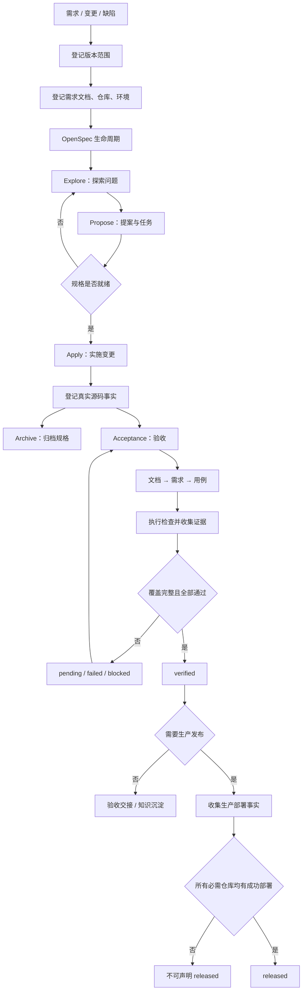
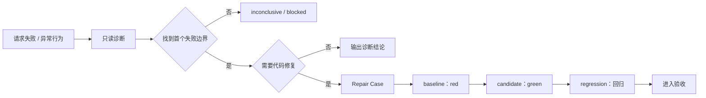

# DeliveryGuard Skill 通用方法论与流程

本文将 `D:\delivery-harness\.agents\skills` 下的 19 个 skill，抽象为一套可迁移的“证据门禁式交付方法”。目标不是复制具体工具或业务流程，而是提取其中稳定的判断逻辑、状态模型、证据要求和安全边界。

## 一、核心结论

这组 skill 不是一条线性流水线，而是：

```text
一个交付主链路
+ 多个风险专项模块
+ 一套统一证据门禁
```

核心原则是：

> 先明确交付对象，再形成可执行意图；执行后只登记真实事实；验证必须闭合证据链；发布必须单独证明；任何外部写入都需要明确授权。

## 二、当前 skill 的整体流程

### 2.1 交付主链路



OpenSpec 的 `Archive` 只代表规格流程关闭，不代表已经验收或发布。

### 2.2 缺陷诊断与修复链路



诊断的关键不是解释最后一个错误，而是找到请求链路中第一个发生偏离的边界。

## 三、19 个 skill 的职责分层

| 层级     | Skill                                                                                                                               | 通用职责                                     |
| -------- | ----------------------------------------------------------------------------------------------------------------------------------- | -------------------------------------------- |
| 主流程   | `version`、`openspec-*`、`acceptance`、`release`                                                                                    | 管理从计划、规格、实现、验收到发布的生命周期 |
| 诊断修复 | `request-diagnosis`、`repair`                                                                                                       | 定位失败边界，形成 red/green/regression 证据 |
| 验证准备 | `fixture-plan`、`notification-test-plan`、`data-review`、`route-review`、`admin-import-plan`、`artifact-intake`、`real-device-test` | 为特定风险场景准备安全、可复现的验证条件     |
| 交付闭环 | `acceptance-handoff`、`knowledge-capture`                                                                                           | 生成证据交接稿，沉淀脱敏知识                 |

专项 skill 不应直接跳过主流程门禁。它们只负责提供计划、事实或证据。

## 四、核心状态机

生命周期阶段由事实推导，不能由执行者手工覆盖：

```text
planned
  ↓ 需求文档完整，OpenSpec ready
specified
  ↓ 所有必需仓库已有 submitted / merged 源码事实
implemented
  ↓ 验收覆盖完整，所有用例通过，证据有效
verified
  ↓ 所有必需仓库有成功的生产部署、具体锚点和时间
released
```

各阶段的含义：

- `planned`：存在交付意图，但规格尚未形成完整执行契约。
- `specified`：范围、文档和规格已经可执行。
- `implemented`：代码事实已经存在。
- `verified`：行为已经通过完整验收证据证明。
- `released`：生产部署事实已经证明。

必须保持以下事实隔离：

- OpenSpec 完成不等于代码完成。
- 测试通过不等于验收覆盖完整。
- 验收通过不等于生产发布。
- 预览或测试环境地址不等于生产部署锚点。
- 诊断结论不等于修复完成。

## 五、通用方法论：证据门禁式交付

### 第一步：定义交付对象

明确版本、变更或缺陷的范围：

- 哪些文档是输入。
- 哪些仓库、环境和用户路径受影响。
- 哪些内容属于非目标。
- 哪些结果需要被证明。

输出：交付范围记录。

### 第二步：把意图变成可执行计划

将需求转换为：

```text
问题 → 范围 → 非目标 → 影响面 → 风险 → 验收标准 → 有序任务
```

输出一份正式提案和一组可验证任务。任务不能在实现前预先标记完成。

### 第三步：执行最小闭环

实施时：

- 先读取设计、任务、仓库规范和当前版本事实。
- 只做已定义范围内的最小变更。
- 保留无关改动。
- 代码和对应检查完成后，才能标记任务完成。
- 只登记真实存在的分支、提交、构建和测试事实。

输出：源码事实和验证结果。

### 第四步：建立证据链

验收从映射开始，而不是从主观结论开始：

```text
文档 → 需求 → 用例 → 执行结果 → 证据文件
```

基本要求：

- 每个登记文档都被覆盖。
- 每条需求都关联可执行用例。
- 每个通过或失败用例都有真实证据。
- `blocked` 和 `skipped` 必须写明具体原因。
- 先执行确定性检查，再执行交互式或真机检查。
- 证据至少包含环境、版本、提交、时间和观察结果。

### 第五步：根据证据推导结论

统一结论规则：

```text
全部通过 + 覆盖完整 = passed
存在已验证失败 = failed
依赖不可用导致无法执行 = blocked
主动不执行 = skipped，但必须说明原因
覆盖不完整 = pending
```

没有证据的结论不能升级为更高生命周期阶段。

### 第六步：把发布作为独立事实

发布需要额外证明：

- 每个必需仓库都有生产部署记录。
- 部署结果为成功。
- 存在具体部署锚点。
- 存在发布时间。
- 如果策略要求，验收已经通过。

验收和发布是两个独立维度。发布失败不应抹掉已有验收证据。

### 第七步：沉淀可复用经验

完成后提取：

```text
症状 → 影响 → 已验证原因 → 无效尝试 → 最终解决 → 验证证据 → 可复用规则
```

写入知识前应删除凭证、个人信息、私有 URL、绝对路径、内部名称和临时日志。

## 六、专项模块的通用安全模型

| 场景       | 必须保留的控制逻辑                                                 |
| ---------- | ------------------------------------------------------------------ |
| 请求诊断   | 区分页面状态、传输状态、业务状态和下游状态；优先追踪首个失败边界   |
| 修复验证   | 必须有不同的 baseline 和 candidate，并执行回归检查                 |
| 测试夹具   | 使用合成数据、明确初始状态、状态转换、幂等键、预期副作用和清理方式 |
| 数据审查   | 只读、范围受限、字段最小化、聚合与源数据对账、结果脱敏             |
| 通知测试   | 分离状态转换、收件人规则、去重、平台投递和用户可见结果             |
| 路由审查   | 从代码差异识别真实可达路由，只准备注册计划，不直接写网关           |
| 制品接收   | 校验类型、大小、哈希、来源、敏感信息，并保存到仓库相对路径         |
| 真机测试   | 设备、原生、WebView、H5 分层判断；运行时重新发现设备和元素         |
| 管理端导入 | 校验 ID、父子关系、路由、排序和增量安全，不直接执行导入            |

## 七、每个通用 skill 的蒸馏模板

每个 skill 最终可以压缩为七段：

```text
1. 触发条件：什么时候使用
2. 前置事实：执行前必须已知什么
3. 最小动作：只做哪些事情
4. 输出事实：产生哪些可验证结果
5. 失败分支：何时返回 failed / blocked / inconclusive
6. 权限边界：哪些动作必须单独授权
7. 清理要求：执行后必须撤销或清理什么
```

## 八、推荐的蒸馏后架构

不要把 19 个 skill 合并成一个巨大 skill，建议保留“核心主链 + 专项插件”：

```text
核心交付引擎
├── 范围与规格
├── 实施与源码事实
├── 验收与证据
└── 生产发布

专项能力插件
├── 缺陷诊断
├── 修复验证
├── 数据查询
├── 测试夹具
├── 通知验证
├── 路由审查
├── 真机验证
└── 制品管理

治理闭环
├── 交接
└── 知识沉淀
```

核心流程负责“状态和门禁”，专项 skill 负责“如何获得事实”，证据负责“为什么可以下结论”。

## 九、必须保留的停止规则

- 没有明确范围、版本、仓库或环境，不升级交付结论。
- 没有找到首个失败边界，只能报告 `inconclusive` 或 `blocked`。
- 没有明确授权，不执行外部写入、生产操作或敏感动作。
- 缺少证据，不得声明通过。
- 存在失败用例，不得声明验收通过。
- 没有生产部署锚点，不得声明已发布。

## 十、来源与适用范围

本总结基于以下仓库事实整理：

- `D:\delivery-harness\AGENTS.md`
- `D:\delivery-harness\docs\architecture.zh-CN.md`
- `D:\delivery-harness\docs\configuration.zh-CN.md`
- `D:\delivery-harness\docs\codex-skills.zh-CN.md`
- `D:\delivery-harness\.agents\skills\` 下全部 19 个 `SKILL.md`
- 验收、夹具、Android、iOS 相关引用文档
- `src/status.ts` 与 `src/validate.ts`

该方法论适合软件交付、变更管理、缺陷修复、验收和发布治理。迁移到其他领域时，应替换具体的仓库、环境、部署和工具概念，但保留“事实—证据—门禁—授权”的骨架。
