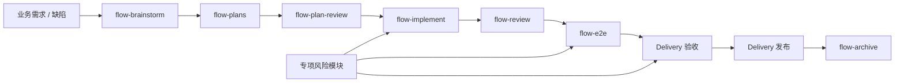

# `flow-*` 与 DeliveryGuard 流程对比

本文对比当前 `D:\skills\.agents\skills\flow-*` 与 `D:\delivery-harness\.agents\skills` 下的 DeliveryGuard skill，说明两套流程的定位差异、能力映射、当前缺口和推荐整合方式。

## 一、核心结论

两套流程不是替代关系：

> `flow-*` 负责“怎么把事情做完”；DeliveryGuard 负责“凭什么证明事情真的完成了”。

```text
flow-*：
需求决策 → 技术设计 → 任务实现 → 代码审查 → E2E → 归档

DeliveryGuard：
交付范围 → 规格事实 → 源码事实 → 验收证据 → 生产部署事实 → 发布
```

更合理的关系是：

```text
flow-* 负责开发过程
        ↓ 产生设计、任务、代码、测试、审查和 E2E 产物
DeliveryGuard 负责交付事实、证据闭环和发布门禁
```

## 二、整体流程对照



DeliveryGuard 的 OpenSpec 可以作为 `flow-plans` 和 `flow-implement` 的交付事实映射；它的 Acceptance 和 Release 则补足 `flow` 当前较弱的交付证明部分。

## 三、阶段能力映射

| 阶段 | `flow-*` 能力 | DeliveryGuard 对应能力 | 差异 |
| --- | --- | --- | --- |
| 需求分析 | `flow-brainstorm`：业务闭环、方案比较、边界确认 | `openspec-explore`：问题、约束、风险探索 | `flow` 更强调业务决策，DeliveryGuard 更强调交付事实 |
| 技术规划 | `flow-plans`：生成 `design.md`、`task.md` | `openspec-propose`：生成 proposal、tasks | DeliveryGuard 额外绑定版本、文档和仓库 |
| 计划审查 | `flow-plan-review`：决策 → 设计 → 任务追踪和场景反证 | 没有同等强度的计划审查 | 这是 DeliveryGuard 的缺口 |
| 实现 | `flow-implement`：依赖调度、TDD、增量验证 | `openspec-apply`：实施并登记源码事实 | `flow` 更细化执行调度，DeliveryGuard 更关注提交事实 |
| 代码审查 | `flow-review`：分级问题、用户确认、修复验证 | 没有直接对应 skill | DeliveryGuard 的验收不能替代代码审查 |
| E2E | `flow-e2e`：真实浏览器、能力预检、场景报告 | `acceptance`、`real-device-test` 及专项验证 skill | `flow` 更偏执行协议，DeliveryGuard 更偏证据和结论合法性 |
| 验收 | `flow-e2e` 验证集成场景 | `acceptance`：文档 → 需求 → 用例 → 证据 | DeliveryGuard 有完整覆盖模型 |
| 缺陷修复 | `flow-bugfix`：`fix.md`、修复、验证 | `request-diagnosis` + `repair` | DeliveryGuard 强制首个失败边界和 red/green/regression |
| 归档 | `flow-archive`：`log.md`、`retro.md`、清理、Git commit | `openspec-archive`、handoff、knowledge-capture | `flow` 偏过程收口，DeliveryGuard 偏事实收口 |
| 发布 | 没有独立发布状态 | `release`：生产部署、部署锚点、发布时间 | 这是 `flow` 最大缺口 |

## 四、`flow-*` 已经较强的部分

当前 `flow-*` 在工程执行控制上比 DeliveryGuard 更完整：

- 先业务决策，再技术设计，再进入实现。
- `flow-plan-review` 能反查决策是否完整落到设计和任务。
- `flow-implement` 有任务依赖、并行条件和写入范围控制。
- `flow-review` 有用户确认门槛，不允许审查后擅自修改。
- `flow-e2e` 有工具能力预检、失败次数限制和临时文件清理。
- `flow-bugfix` 能区分缺陷、小型变更和需要重新决策的新功能。
- `flow-archive` 有日志、复盘和 Git 收口。

因此，`flow-*` 已经是一套较好的“开发过程治理系统”。

## 五、`flow-*` 当前缺口

### P0：缺少统一的交付事实模型

当前主要产物是：

```text
design.md
task.md
fix.md
review.md
e2e-report.md
log.md
retro.md
```

但缺少一个统一对象回答：

```text
这次交付是什么版本？
涉及哪些需求文档？
影响哪些仓库？
目标环境是什么？
当前处于 planned / specified / implemented / verified / released 哪一阶段？
```

建议增加一个交付记录，例如：

```text
delivery.md
```

或者：

```text
manifest.json
```

至少记录：

- 交付 ID 或版本。
- 主需求文档和支持文档。
- 影响仓库。
- 目标环境。
- OpenSpec 或 design 入口。
- 源码提交。
- 验收报告。
- 生产部署锚点。
- 当前派生状态。

### P0：缺少完整的验收覆盖矩阵

当前 `flow-e2e` 主要验证任务中的集成场景，尚未强制建立：

```text
文档 → 需求 → 用例 → 执行结果 → 证据
```

这会产生两个风险：

- E2E 通过，但某个需求没有被验证。
- 测试通过，但没有留下可追溯的证据文件。

建议将集成验证扩展为独立验收矩阵：

```markdown
| 文档 | 需求 | 用例 | 状态 | 证据 | 备注 |
| --- | --- | --- | --- | --- | --- |
```

统一状态：

```text
覆盖不完整 = pending
存在已验证失败 = failed
依赖不可用 = blocked
主动不执行 = skipped
全部覆盖且全部通过 = passed
```

### P0：缺少 `verified` 与 `released` 的严格分离

当前容易形成以下错误认知：

```text
代码完成 + 测试通过 + Git 提交 = 已交付
```

建议增加独立发布门禁：

```text
verified
  ↓
生产部署成功
  ↓
每个必需仓库都有部署事实
  ↓
有生产锚点和发布时间
  ↓
released
```

不能用以下内容代替生产发布证据：

- 本地 commit。
- 测试环境地址。
- 预览链接。
- E2E 通过。
- 代码已合并。

### P1：缺少统一的阻塞和不确定性语义

目前不同 flow 使用了“需人工介入”“阻塞”“延后”“跳过”等不同表达。

建议统一为：

```text
passed        已验证通过
failed        已验证失败
blocked       因依赖、权限或环境无法验证
inconclusive  证据不足，无法确认结论
skipped       主动跳过，并说明原因
pending       尚未完成或覆盖不足
```

### P1：缺少统一的外部操作授权边界

建议全局采用：

```text
默认只读
涉及外部写入时必须确认
涉及生产时必须确认具体目标
涉及凭证、账号、支付、消息或业务数据时重新授权
```

覆盖的动作包括：

- 数据库写入。
- 发消息或通知。
- 网关和路由注册。
- 真机安装、签名和系统设置变更。
- 生产部署。
- 外部平台配置。

### P1：缺少证据制品治理

`e2e-report.md` 记录了结果，但还应约束证据文件本身：

- 是否来自当前运行。
- 是否对应当前提交。
- 是否包含敏感信息。
- 是否位于仓库相对路径。
- 是否经过脱敏。
- 是否包含时间和环境标识。

### P2：缺少专项风险插件

DeliveryGuard 已将以下场景抽成独立模块，而当前 `flow-*` 覆盖较少：

- 请求链路首个失败边界。
- 只读数据审查。
- 测试夹具和清理。
- 通知状态转换。
- 路由变更审查。
- 管理端层级导入。
- 真机分层验证。
- 证据制品接收。

这些能力适合作为按需启用的专项 flow，不应全部塞入主链路。

## 六、推荐的整合架构

不要把 DeliveryGuard 的所有门禁硬塞进现有 `flow-*`，建议增加一层 Delivery Governance：

```text
业务决策层
└── flow-brainstorm

计划设计层
├── flow-plans
└── flow-plan-review

工程执行层
├── flow-implement
├── flow-review
└── flow-e2e

交付事实层
├── delivery-record
├── evidence-matrix
├── delivery-acceptance
└── delivery-release

专项风险层
├── diagnosis
├── repair
├── fixture
├── data-review
├── notification
├── route-review
├── artifact-intake
└── real-device

交付收口层
├── flow-archive
├── acceptance-handoff
└── knowledge-capture
```

推荐主链：

```text
flow-brainstorm
    ↓
flow-plans
    ↓
flow-plan-review
    ↓
flow-implement
    ↓
flow-review
    ↓
flow-e2e
    ↓
delivery-acceptance
    ↓
delivery-release
    ↓
flow-archive
```

## 七、最优先补齐的五项能力

1. 增加统一 `delivery.md` 或 `manifest.json`。
2. 将 `task.md` 的集成验证升级为文档—需求—用例—证据矩阵。
3. 增加 `verified` 与 `released` 两个独立门禁。
4. 统一 `passed / failed / blocked / inconclusive / skipped / pending` 状态。
5. 增加默认只读和外部写入授权规则。

## 八、最终判断

你的 `flow-*` 缺的不是更多研发步骤，而是“交付事实层”。

它已经能较好地指导 Agent：

```text
如何理解需求、如何设计、如何实现、如何审查、如何验证和如何归档
```

但它还不能严格证明：

```text
这次交付范围是否完整？
所有需求是否都被验证？
证据是否可复核？
是否真的部署到了生产？
是否可以合法地称为 released？
```

第一性拆分应当是：

> `flow-*` 负责决策和执行；Delivery 层负责事实登记、证据闭合和发布判定。

## 九、依据文件

### `flow-*` 文件

- `D:\skills\.agents\skills\flow-brainstorm\SKILL.md`
- `D:\skills\.agents\skills\flow-plans\SKILL.md`
- `D:\skills\.agents\skills\flow-plan-review\SKILL.md`
- `D:\skills\.agents\skills\flow-implement\SKILL.md`
- `D:\skills\.agents\skills\flow-review\SKILL.md`
- `D:\skills\.agents\skills\flow-e2e\SKILL.md`
- `D:\skills\.agents\skills\flow-bugfix\SKILL.md`
- `D:\skills\.agents\skills\flow-archive\SKILL.md`

### DeliveryGuard 文件

- `D:\delivery-harness\AGENTS.md`
- `D:\delivery-harness\docs\architecture.zh-CN.md`
- `D:\delivery-harness\docs\configuration.zh-CN.md`
- `D:\delivery-harness\docs\codex-skills.zh-CN.md`
- `D:\delivery-harness\.agents\skills\` 下全部 19 个 `SKILL.md`
- `D:\delivery-harness\src\status.ts`
- `D:\delivery-harness\src\validate.ts`

